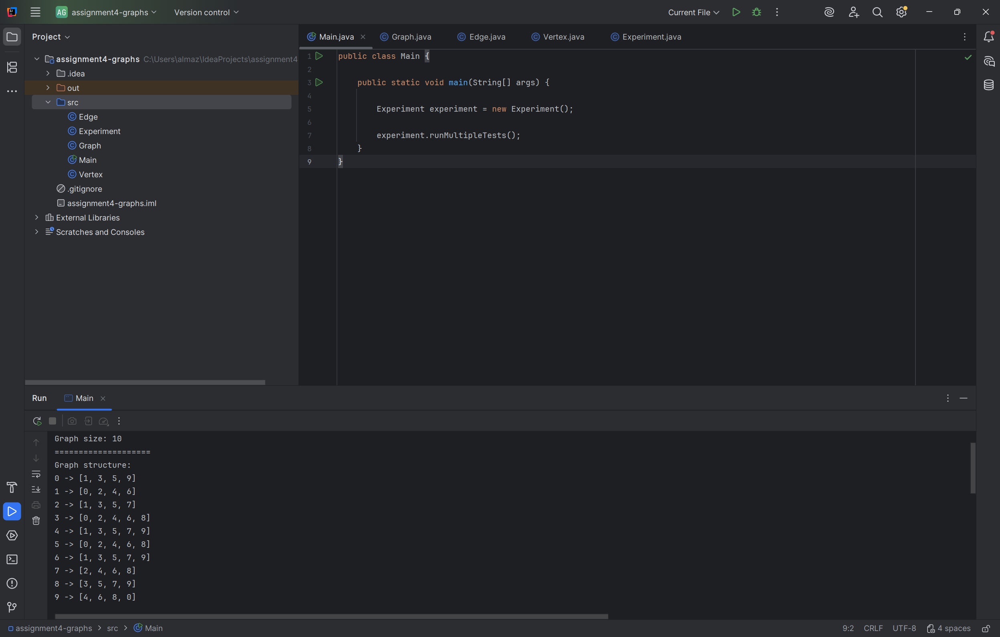
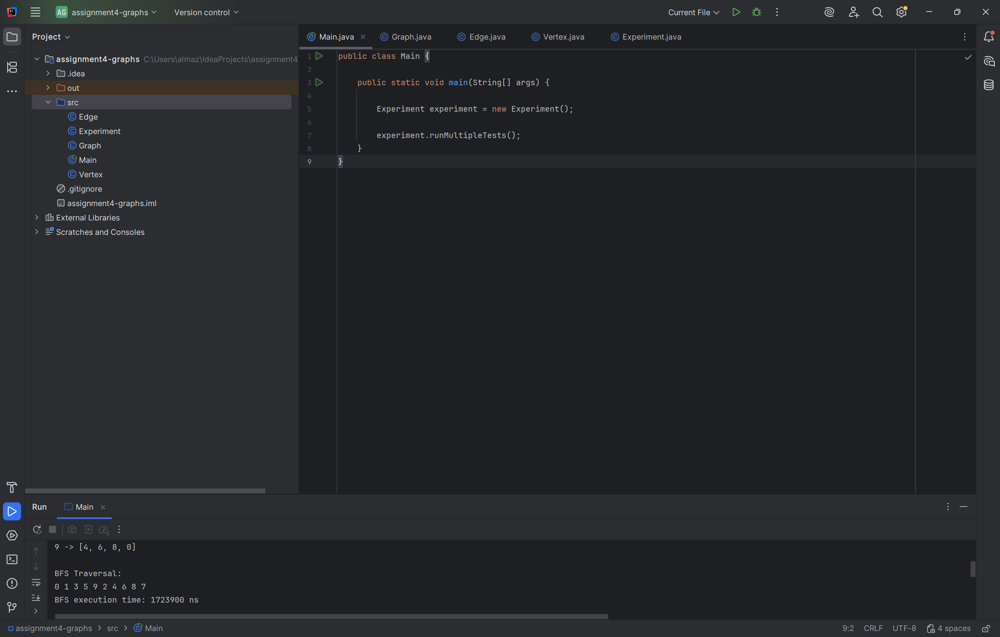
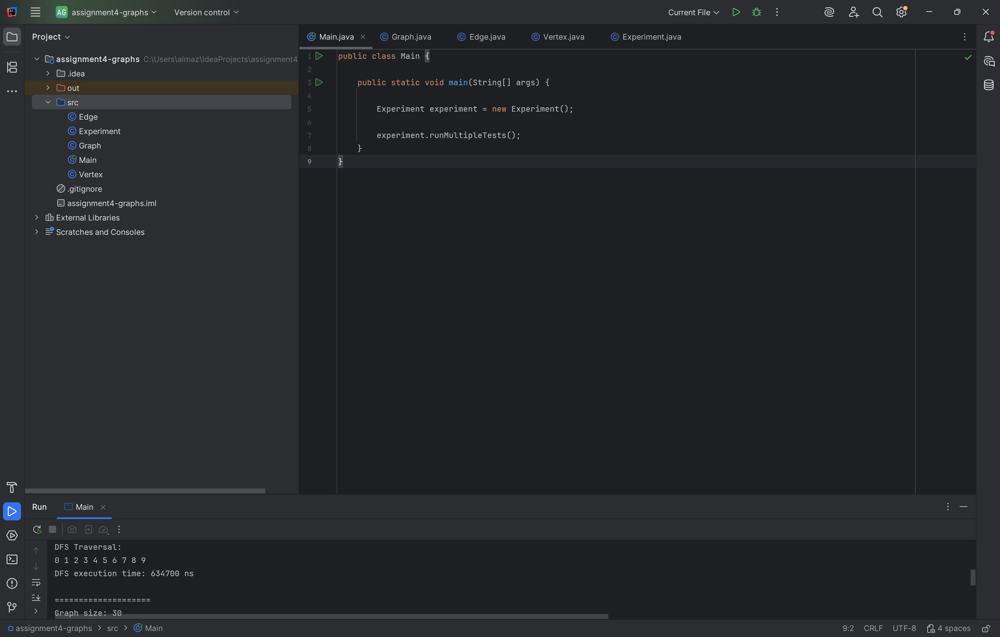
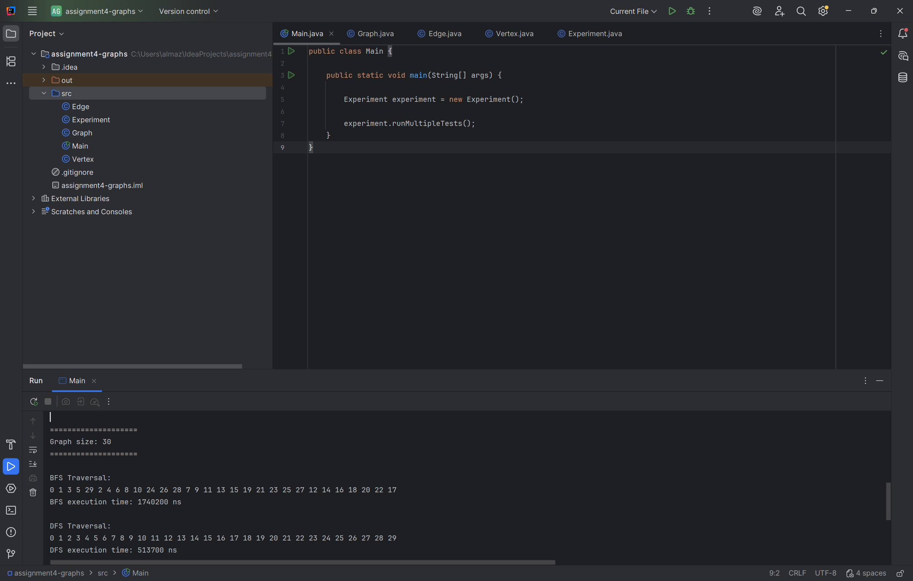
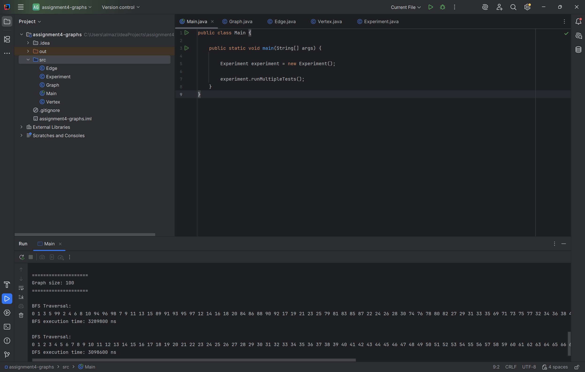

# Assignment 4 - Graph Traversal and Representation System

## Project Overview

This project implements graph traversal algorithms using adjacency list representation in Java.

The project includes:
- Vertex class
- Edge class
- Graph class
- BFS traversal
- DFS traversal
- Performance analysis

The program creates graphs of different sizes and compares the performance of BFS and DFS algorithms.

---

## Graph Representation

The graph is represented using adjacency list with HashMap and ArrayList.

Each vertex stores a list of connected vertices. This representation is memory efficient and suitable for sparse graphs.

---

## Class Descriptions

### Vertex Class

The Vertex class represents a graph vertex and stores vertex id.

### Edge Class

The Edge class represents connection between two vertices.

### Graph Class

The Graph class stores adjacency list and implements BFS and DFS traversal methods.

### Experiment Class

The Experiment class runs graph traversal experiments and measures execution time.

---

## Breadth-First Search (BFS)

BFS visits vertices level by level using Queue.

### Steps:
1. Add start vertex to queue
2. Visit vertex
3. Add neighbors to queue
4. Repeat until queue becomes empty

### Time Complexity

O(V + E)

### Use Cases
- Shortest path
- Network traversal
- Social networks

---

## Depth-First Search (DFS)

DFS visits vertices deeply before backtracking.

DFS uses recursion.

### Steps:
1. Visit vertex
2. Go deeper to neighbor
3. Repeat recursively
4. Backtrack after visiting all neighbors

### Time Complexity

O(V + E)

### Use Cases
- Path finding
- Cycle detection
- Topological sorting

---

## Experimental Results

| Graph Size | BFS Time (ns) | DFS Time (ns) |
|------------|---------------|---------------|
| 10         | 1723900       | 634700        |
| 30         | 1740200       | 513700        |
| 100        | 3289800       | 3098600       |

### Observation

Execution time generally increases as graph size becomes larger.

DFS was faster for smaller graphs in these experiments, while BFS and DFS showed similar performance on larger graphs.

Both algorithms follow O(V + E) complexity.

---

## Analysis Questions

### How does graph size affect BFS and DFS performance?

As graph size increases, traversal time also increases because more vertices and edges are processed.

### Which traversal is faster?

DFS was slightly faster in some experiments.

### Do results match O(V + E)?

Yes. Both algorithms visit every vertex and edge once.

### How does graph structure affect traversal order?

Traversal order depends on how vertices are connected.

### When is BFS preferred over DFS?

BFS is preferred for shortest path problems.

### What are the limitations of DFS?

DFS may cause stack overflow for very deep graphs.

---

## Screenshots

### Graph Structure

### BFS Traversal

### DFS Traversal

### Medium Graph Results

### Large Graph Results

---

## Reflection

In this assignment I learned how graph traversal algorithms work using adjacency list representation.

I understood the main difference between BFS and DFS. BFS uses Queue and explores graph level by level, while DFS uses recursion and explores deeply before backtracking.

The most challenging part was understanding graph traversal logic and implementing adjacency list correctly.